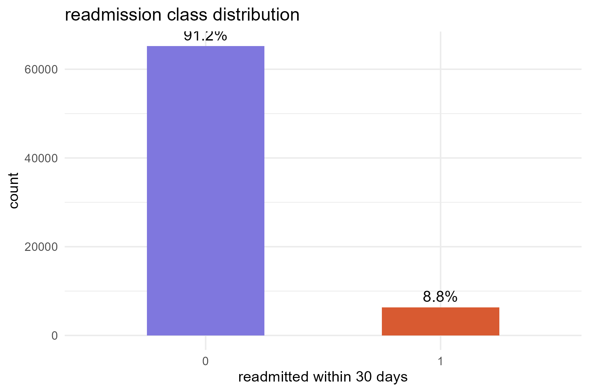
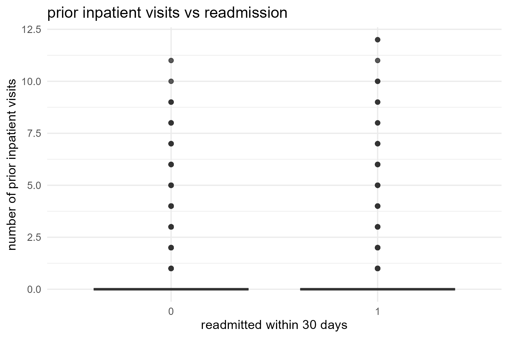
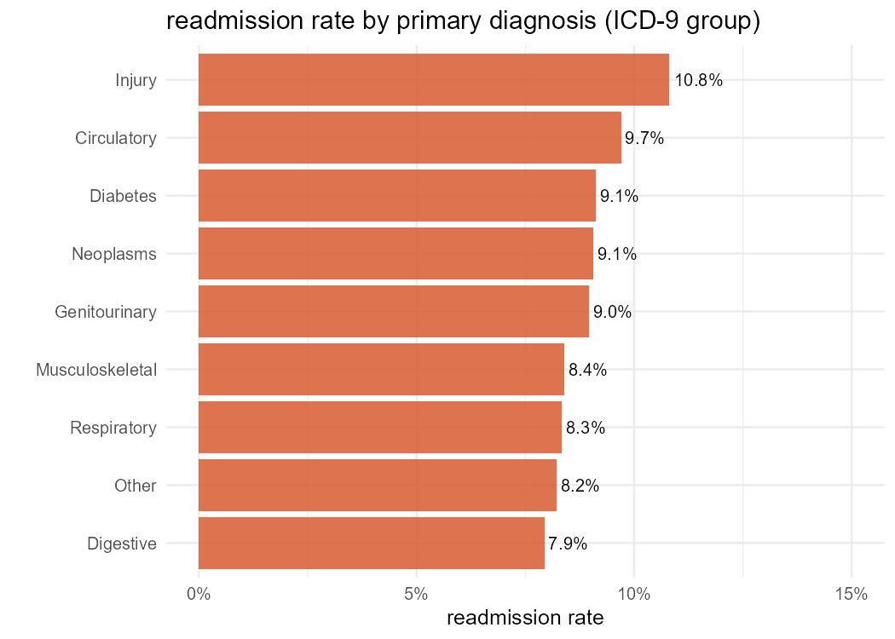
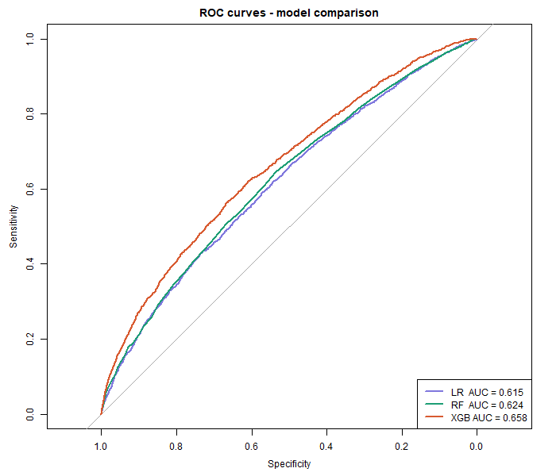
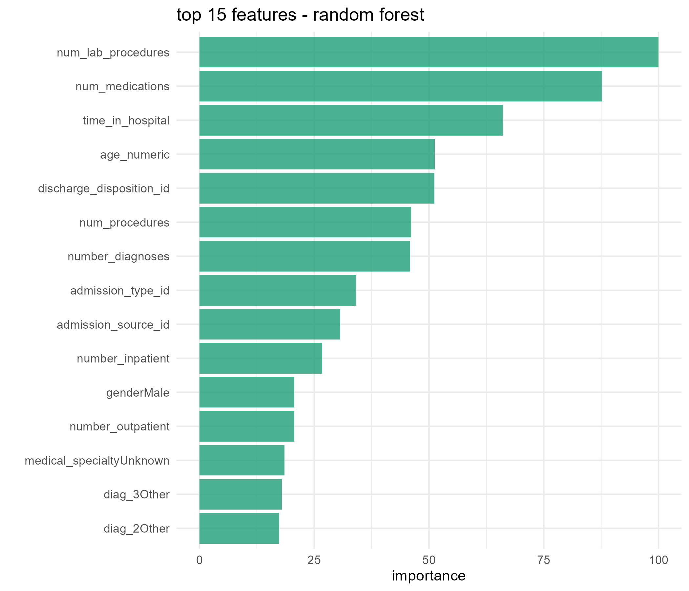
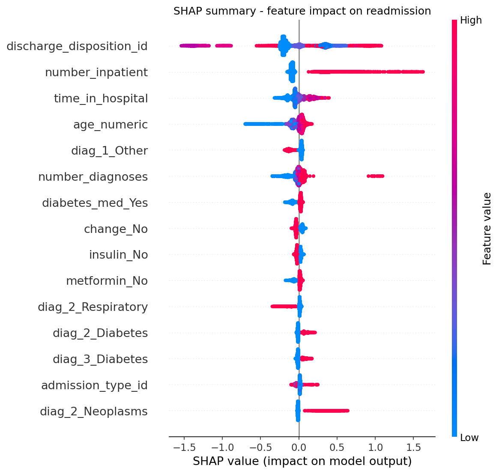

## introduction

Hospital readmission within 30 days is one of the most closely watched quality
indicators in US healthcare. Under the Hospital Readmissions Reduction Program,
the Centers for Medicare and Medicaid Services penalizes hospitals with higher
than expected readmission rates. For diabetic patients specifically, managing
readmission risk is particularly challenging because diabetes is a chronic
condition requiring continuous monitoring.

This project uses 10 years of clinical data from 130 US hospitals (1999-2008)
to build and compare machine learning models that predict whether a diabetic
patient will be readmitted within 30 days of discharge.

## dataset

The dataset comes from the UCI Machine Learning Repository and contains 101,766
patient encounters across 50 features including demographics, diagnoses,
medications, and lab results.

After removing duplicate patient encounters (keeping only the first visit per
patient to avoid data leakage), the working dataset contained 71,518 records.
The target variable — readmission within 30 days — was heavily imbalanced at
approximately 9:1 (91.2% not readmitted, 8.8% readmitted within 30 days).

**Key data quality issues identified:**

- `weight` — 96.9% missing, dropped
- `medical_specialty` — 49.1% missing, replaced with "Unknown"
- `payer_code` — 39.6% missing, dropped
- `diag_1/2/3` — ICD-9 codes with 700+ levels, grouped into 9 clinical categories
- `age` — stored as ranges (e.g. [50-60)), converted to numeric midpoints

## exploratory analysis

Class imbalance was the defining characteristic of this dataset. After
deduplication, only 8.8% of patients were readmitted within 30 days, making
standard accuracy a misleading metric.

```{r echo=FALSE, out.width="70%"}

```

Prior inpatient visits emerged as a strong visual predictor during EDA —
patients who had been admitted before were noticeably more likely to return.

```{r echo=FALSE, out.width="70%"}

```

Readmission rates also varied by primary diagnosis, with circulatory and
respiratory conditions showing higher rates than musculoskeletal or injury
diagnoses.

```{r echo=FALSE, out.width="70%"}

```

## modeling approach

Three models were trained and compared:

- **Logistic Regression** — baseline, interpretable
- **Random Forest** — ensemble, handles non-linearity
- **XGBoost** — gradient boosting, generally strongest on tabular data

Training used a manually balanced dataset of 20,000 records (10,000 per class)
to address the 9:1 imbalance. The test set was kept at its natural distribution.
5-fold cross-validation with ROC-AUC as the evaluation metric was used for
model selection.

## results

```{r echo=FALSE, message=FALSE}
library(tidyverse)
results <- read_csv("../outputs/results/model_comparison.csv")
knitr::kable(results, caption = "model comparison on held-out test set")
```

```{r echo=FALSE, out.width="80%"}

```

XGBoost achieved the highest AUC (0.658) and F1 score (0.223) on the test set.
Logistic regression had the highest recall (0.530), meaning it identified more
actual readmissions at the cost of more false positives. For clinical
deployment, recall is arguably the more important metric — missing a high-risk
patient has greater consequences than an unnecessary follow-up call.

## feature importance

Random forest variable importance and SHAP values from XGBoost both pointed to
the same top features.

```{r echo=FALSE, out.width="80%"}

```

```{r echo=FALSE, out.width="80%"}

```

The most important finding is that `discharge_disposition_id` — where the
patient goes after leaving hospital — is by far the strongest predictor of
readmission. This suggests that care transitions, not just in-hospital
treatment, drive readmission risk. Patients discharged to skilled nursing
facilities or those discharged against medical advice showed very different
readmission patterns.

`number_inpatient` (prior inpatient visits) was the second strongest predictor,
consistent with clinical intuition that patients with a history of
hospitalizations are at higher risk.

Medication-related features — particularly whether insulin was prescribed and
whether medications were changed during the visit — also contributed
meaningfully, suggesting that medication management decisions at discharge
carry predictive signal.

## conclusions

XGBoost performed best overall with an AUC of 0.658. While this is moderate
performance, it is consistent with published results on this dataset, where
AUCs in the 0.62-0.70 range are typical given the noise inherent in
administrative clinical data.

The most actionable finding is the dominance of discharge disposition as a
predictor. Hospitals looking to reduce readmissions might focus intervention
resources on patients being discharged to certain destinations, particularly
those with multiple prior inpatient visits and unclear primary diagnoses.

**Limitations:**

- Dataset is from 1999-2008 and may not reflect current clinical practice
- Administrative data lacks granular clinical details like vital signs and lab values
- Class imbalance limits model sensitivity even after balancing

## references

Strack et al. (2014). Impact of HbA1c measurement on hospital readmission
rates: analysis of 70,000 clinical database patient records. BioMed Research
International.

UCI Machine Learning Repository. Diabetes 130-US hospitals for years 1999-2008.
https://archive.ics.uci.edu/dataset/296/